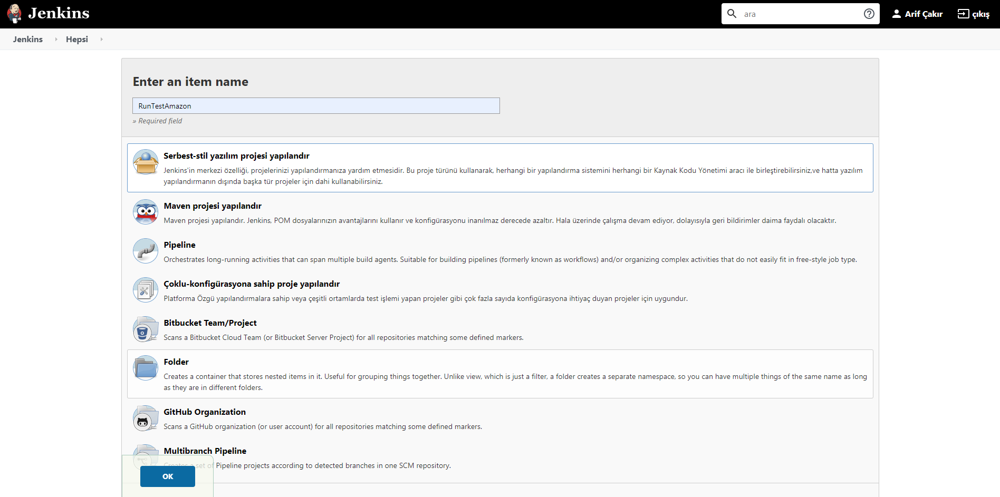
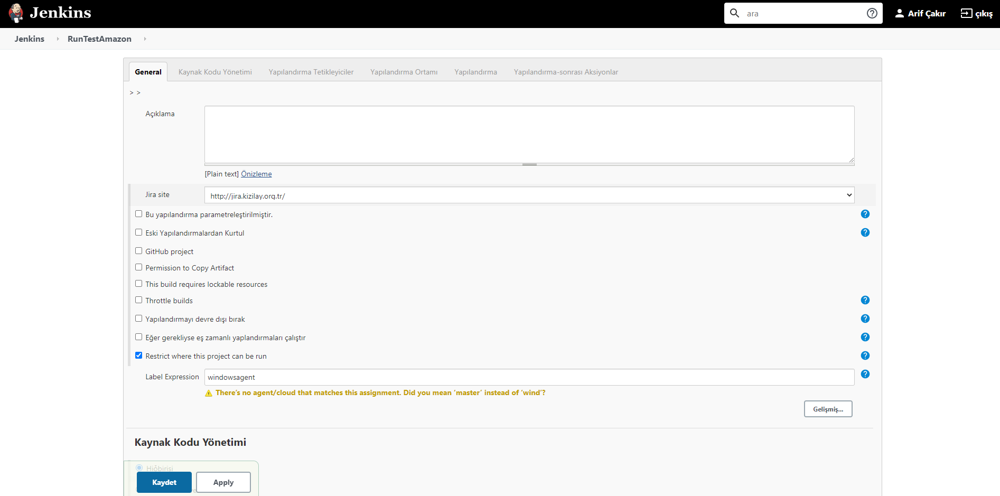
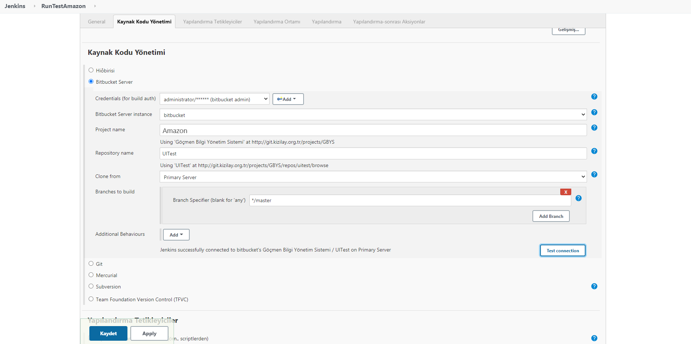
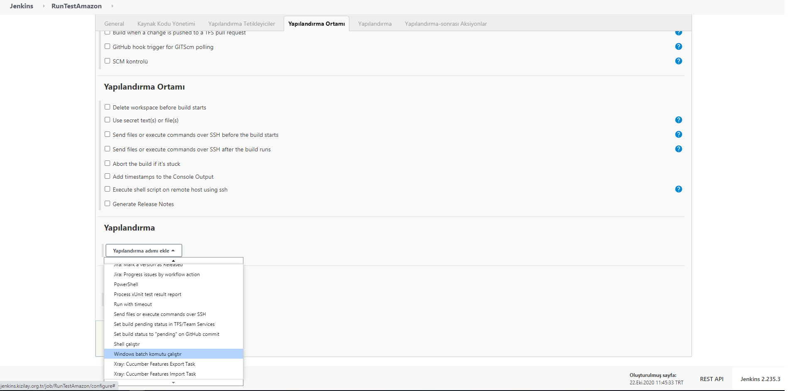
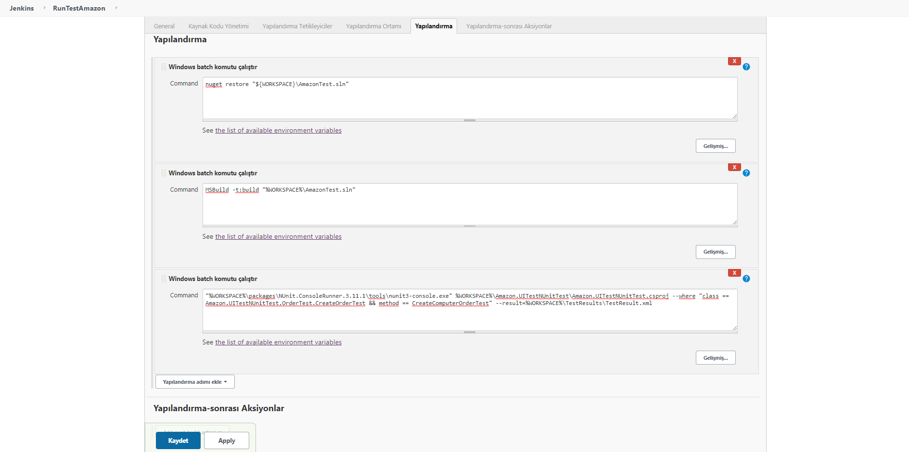
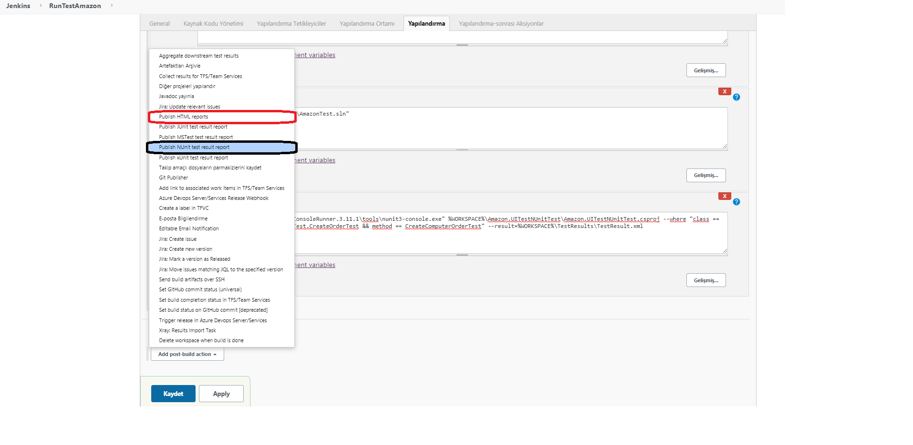
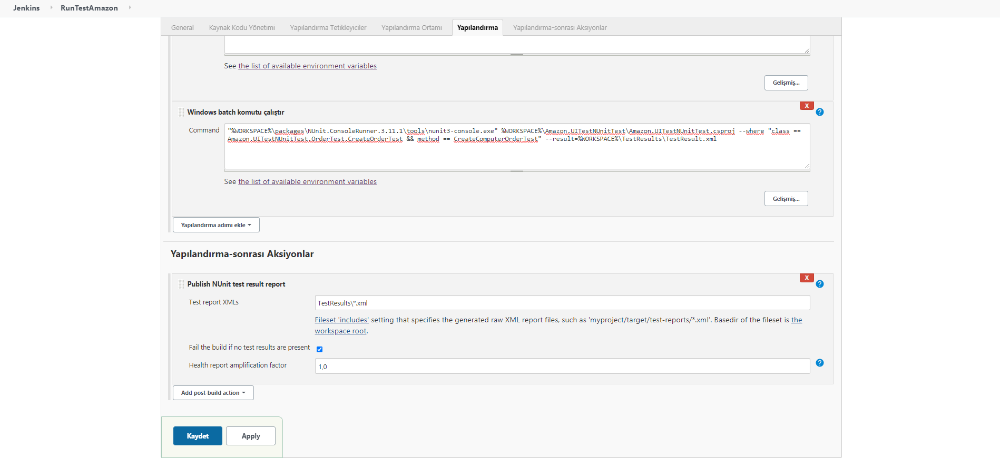
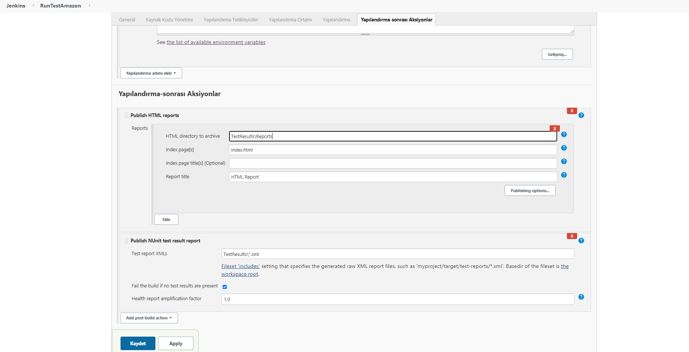

# Jenkins ile NUnit Test Koşumu ve Raporlanması 

 Selenium WebDriver ile yazdıgınız otomasyon testlerinizi aşağıdaki adımları takip ederek, Jenkins ile tetikleyebilir ve CI/CD pipeline'nınıza dahil edebilirsiniz.<br>

### Konuyu 4 ana başlıkta toplayabiliriz.
<br>

 >1. Projenin Agent'ın kurulu olduğu server'a **klonlanması**
 >2. NuGet paketlerinin **Restore** edilmesi
 >3. Solution'ın **Build** alınması
 >4. İlgili testlerin **çalıştırılması** ve **raporlanması**

<br>

Adımlara geçmeden öncelikle; Jenkins üzerinde **New Item** diyerek Proje tipini ve adını gireceginiz ekrana gelmeniz gerekiyor.<br> Çalışacagınız projeniz için bir isim belirledikten sonra; ilgili alanı doldurup **Proje Tipi** seçerek **OK** butonuna basabilirsiniz.

<br>

 

<br> 

 Proje oluşturulduktan sonra ilk olarak testleri koşturacagınız agentı seçebiliriniz.

<br>

 

> ## 1. Projenin Agent'ın kurulu olduğu server'a klonlanması
Projenizin bulundugu kaynak kod aracından ilgili repository seçip klonlama işlemini gerçekleştirebilirsiniz.
<br>

  

<br> 

Scriptlerimizi yazabilmek için Yapılandırma (Configure) alanından hangi script dilini kullanmak istiyorsanız seçim yapabilirsiniz. Burada Windows Batch komutu ile ilerleyeceğiz.

<br>

  

<br>

> ## 2. NuGet paketlerinin **Restore** edilmesi
Bu adımda proje içerinde kullanılan paketlerin restore edilerek derlenmesini saglamamız gerekiyor. Restore için aşağıdaki scripti kullanabilirsiniz.

```nuget restore "%WORKSPACE%\AmazonTest.sln"```

<br>

<br>

> ## 3. Solution'ın **Build** alınması

 Paketlerin derlenmesi sonrası projenizi build edebilirsiniz. Build için aşağıdaki scripti kullanabilirsiniz.

```MSBuild -t:build "%WORKSPACE%\AmazonTest.sln"```

<br>

<br>

> ## 4. İlgili testlerin **çalıştırılması** ve **raporlanması** 
<br>

>### 4.1. Testlerin Çalıştırılması
<br>

>#### -  4.1.1 Tüm Test Projesi koşturmak istiyorsanız
<br>

```nunit3-console.exe %WORKSPACE%\Amazon.UITestNUnitTest\Amazon.UITestNUnitTest.csproj```

<br>

>#### - 4.1.2 Bir Test class'ını koşturmak istiyorsanız 
<br>

```nunit3-console.exe %WORKSPACE%\Amazon.UITestNUnitTest\Amazon.UITestNUnitTest.csproj --where "class == Amazon.UITestNUnitTest.CreateOrder.CreateOrderTest"```

<br>

>#### - 4.1.3 Bir Test Classı içindeki tek bir test methodunu koşturmak istiyorsanız
<br>

### `nunit3-console.exe %WORKSPACE%\Amazon.UITestNUnitTest\Amazon.UITestNUnitTest.csproj --where "class == Amazon.UITestNUnitTest.CreateOrder.CreateOrderTest && method == CreateComputerOrderTest"`

<br>

> #### - 4.1.4 Nunit Console ile Belirlenen Methot testi kosturulup, Proje root altına Test Result xml dokümanını olusturma
<br>

### `nunit3-console.exe %WORKSPACE%\Amazon.UITestNUnitTest\Amazon.UITestNUnitTest.csproj --where "class == Amazon.UITestNUnitTest.CreateOrder.CreateOrderTest && method == CreateOrderTechnologyCategory" --result=%WORKSPACE%\TestResults\TestResult.xml`

<br>

  

<br>

>### 4.2. Testlerin Raporlanması
 Test sonuçlarının raporlanması için; koşum sonrası oluşan "TestResult.xml" ve projemizde kullandıgımız ExtentReport ile oluşturdugumuz html formatındaki dokümanları kullacağız. Öncelikle "Yapılandırma Sonrası Aksiyonlar" alanından ilgili raporları ekleyeceğiz.

<br>

  

<br>

> #### - 4.2.1 Publish NUnit Test Result Report kullanımı
 Koşturulan testlerin sonuçlarını NUnit Test Result Report kullarak test sonuçlarını görebiliriz. Aşagıdaki gibi konfigüre edebilirsiniz.

<br>

  

<br>

> #### - 4.2.2 Publish HTML Report kullanımı
 Koşturulan testlerin sonuçlarını HTML Report yardımıyla dashboarda yansıtılmış formatıyla grafikler halinde görebilirsiniz. Aşagıdaki gibi konfigüre edebilirsiniz.

<br>

  

<br>
